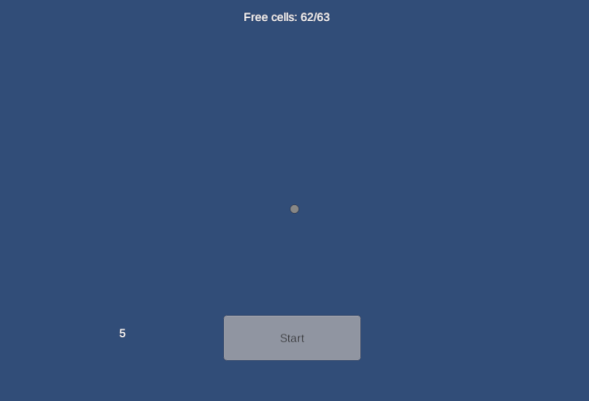
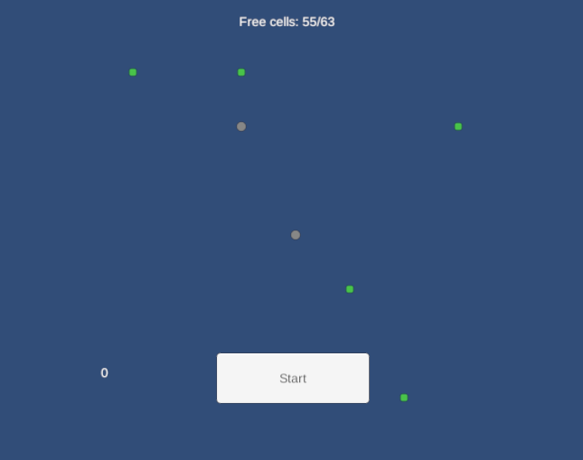
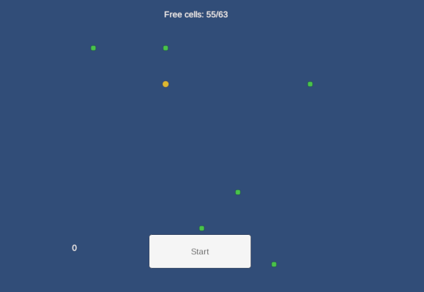
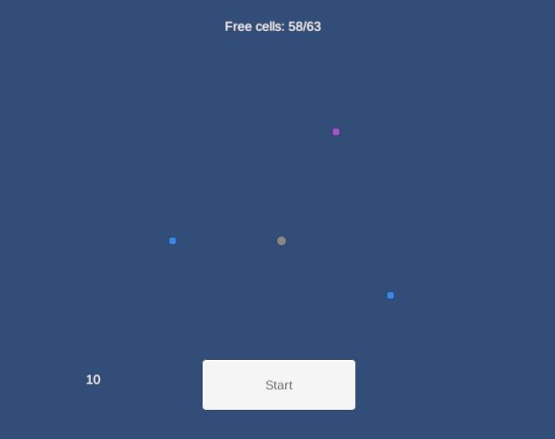

# GHSS - Merge Core Gameplay

Небольшой прототип core-механики мерж-игры на Unity: поле 7×9, предметы четырёх уровней, спавнеры двух уровней с настраиваемыми вероятностями, таймер, drag & drop, UI и юнит-тесты. Сделан как демонстрационный проект с использованием Claude, целевая платформа - WebGL, Android.

## Скриншоты

Все скриншоты лежат в папке [`Demo/`](Demo/) в корне этого репозитория. WebGL-билд, запущенный локально (`serve_local.py`):

| | |
|---|---|
|  |  |
| Начало игры — на поле стартовый Spawner Level 1, таймер уже отсчитывает | Несколько тапов по спавнеру: предметы Level 1 (зелёные) и ещё один Spawner Level 1 (серый), клетки под них выбираются случайно, а не всегда одна и та же |
|  |  |
| Два Spawner Level 1 смержены в один Spawner Level 2 (оранжевый) | Предметы промержены до Level 3 (фиолетовый) и Level 2 (синий) — цвет уровня виден сразу |

## Стек

- Unity 6000.3.10f1, Universal Render Pipeline (2D)
- New Input System
- Unity Test Framework (EditMode)
- Целевая платформа: WebGL

## Быстрый старт

1. Открыть проект в Unity 6000.3.10f1.
2. Открыть сцену `Assets/Scenes/Main.unity`.
3. Нажать Play.
4. Тап по спавнеру создаёт предмет, драг предмета на такой же уровень — мерж, кнопка запускает таймер, по завершении которого появляется новый Spawner Level 1.

Готовый WebGL-билд лежит в этом же репозитории, в папке [`WebGLBuild/`](WebGLBuild/), и запускается локально командой `python WebGLBuild/serve_local.py` — билд нужно открывать по `http://`, а не как `file://` (иначе браузер блокирует загрузку `.wasm`/`.data`). Скрипт сам поднимет сервер и откроет браузер.

## Реализованные механики

- Grid 7×9 (размер задаётся конфигом).
- Item четырёх уровней, merge по правилу "два одинаковых уровня → следующий уровень", Level 4 не мержится.
- Spawner Level 1 (90% / 10%) и Level 2 (50% / 50%), таблицы вероятностей — в конфиге.
- Spawner + Spawner того же уровня → Spawner следующего уровня (тот же механизм мержа, что и у предметов).
- Таймер с UI-кнопкой; по завершении на поле появляется новый Spawner Level 1, если есть свободная клетка.
- Drag & Drop мышью: нажатие, перетаскивание, визуальная обратная связь (подсветка зелёным/красным при наведении на цель), перемещение на свободную клетку, возврат при недопустимом действии.
- UI: кнопка таймера с оставшимся временем, счётчик свободных клеток, всплывающее сообщение о невозможном действии.
- Все балансные величины — в ScriptableObject-конфигах.
- Юнит-тесты (EditMode) на merge-правила, вероятности спавна, грид, таймер.

## Нереализованное / ограничения

- Нет полноценного View-слоя с анимацией перемещения — объекты появляются/двигаются мгновенно (snap), без tween.
- Нет сохранения/загрузки состояния между сессиями — не требовалось по заданию.
- Нет object pooling — предметы создаются/уничтожаются через `Instantiate`/`Destroy`; для объёма задания (63 клетки) это не проблема, но при масштабировании потребовалось бы.
- PlayMode-тесты не писались — юнит-тестами покрыт только Core-слой (то, что тестируется без сцены); Gameplay-слой (фабрики, drag&drop) тестами не покрыт.

---

# Внутреннее устройство проекта

## Какая часть кода за что отвечает (кратко)

Проект разделён на два слоя с реальной границей на уровне сборки (`GHSS.Core.asmdef`), а не только по соглашению об именовании папок:

**`Assets/_Project/Scripts/Core/`** — чистый C#, без обращений к сцене/`Instantiate`/`MonoBehaviour`-побочным эффектам:
- `Board/` — `BoardGrid` (клетки, occupancy, события `ObjectPlaced`/`ObjectRemoved`), `BoardConfig`.
- `Common/` — `LevelChainConfig<T>` и `MergeRules` (правила цепочки уровней и мержа, generic), `ITickable`, `IRandomSource`.
- `Items/`, `Spawners/` — `Item`/`Spawner` (данные + позиция), их конфиги, `WeightedItemRoller` (взвешенный выбор).
- `Timers/` — `CountdownTimer` (тикается извне, без своего `Update`), конфиги таймера.
- `Game/` — `GameConfig`, агрегатор ссылок на остальные конфиги.

**`Assets/_Project/Scripts/Gameplay/`** — всё, что трогает сцену:
- `Items/`, `Spawners/` — фабрики (`ItemFactory`/`SpawnerFactory`, единственное место с `Instantiate`), merge-сервисы.
- `Board/` — `BoardMergeController<TPiece>`, `PieceDropResolver<TPiece>`, `BoardCoordinateConverter`, `BoardFeedbackChannel`.
- `Interaction/` — `PieceDragController<TPiece>` (визуал драга).
- `PointerInput/` — `ItemPointerInput`/`SpawnerPointerInput` (единственные классы, знающие про `PointerEventData`), `BoardInputBinder` (авто-подключение input к новым объектам).
- `Timers/` — `TimerService` (единственный `Update()` на все таймеры), `TimedSpawnerController`.
- `UI/` — `SpawnTimerView`, `BoardStateView`, `ActionFeedbackView` — чистая презентация, без игровой логики.
- `Bootstrap/` — `GameBootstrap`, единственная точка сборки всего проекта.

**`Assets/_Project/Tests/EditMode/`** — юнит-тесты Core-слоя, отдельная сборка, физически не видит `Gameplay`.

## Какую структуру выбрали и почему

Отправная точка — предположение, что почти все требования задания ("предмет", "спавнер") на самом деле являются одной и той же сущностью: объект на клетке поля с уровнем, который умеет мержиться с себе подобным. Вместо двух параллельных реализаций (для Item и для Spawner) была выбрана generic-архитектура: единая модель клетки/поля (`BoardGrid`, независим от типа объекта через интерфейс `IBoardObject`) и единая цепочка правил (`LevelChainConfig<T>`, `MergeRules.CanMerge<T>`), которые используются и предметами, и спавнерами без дублирования.

Разделение Core/Gameplay выбрано ради тестируемости и связности: логика, которую можно проверить юнит-тестом без сцены (мерж, вероятности, грид, таймер), физически изолирована в отдельную сборку — если бы кто-то попытался добавить в неё `MonoBehaviour`-зависимость, проект перестал бы компилироваться, а не просто "по договорённости не делай так".

Все балансные величины (размер поля, уровни, вероятности, длительность таймера) вынесены в ScriptableObject-конфиги, а не в код — это было явным требованием задания, и заодно снижает связность: изменение баланса не требует пересборки скриптов.

## Какие паттерны использовали

- **Generic-переиспользование вместо дублирования** — `LevelChainConfig<TDefinition>`, `BoardMergeController<TPiece>`, `PieceDragController<TPiece>`, `PieceDropResolver<TPiece>`, `IMergeService<TPiece>`: один и тот же код обслуживает и Item, и Spawner. Обобщение вводилось не заранее "про запас", а только когда второй конкретный случай (Spawner) реально появился и требовал той же механики — иначе получился бы overengineering.
- **Factory** — `ItemFactory`/`SpawnerFactory`: единственные места, где вызывается `Instantiate`.
- **Observer/события** — `BoardGrid.ObjectPlaced/Removed`, `BoardFeedbackChannel`, `CountdownTimer.Ticked/Completed`. Например, `BoardInputBinder` подписывается на `ObjectPlaced` и сам подключает input к любому новому объекту, независимо от того, создан он мержем, спавном или таймером — фабрикам не нужно ничего знать про drag&drop.
- **Dependency Injection через конструктор / явный `Construct()`** — нигде нет `FindObjectOfType` или синглтонов; все зависимости передаются явно.
- **Composition Root** — `GameBootstrap`: единственный класс, знающий про все системы сразу, но не принимающий ни одного игрового решения (только `new` и `Construct`), поэтому не является God Object.
- **`TryX`-паттерн вместо исключений** для ожидаемых неудач (`TryPlace`, `TryMerge`, `TryActivate`, `TryResolveDrop`) — исключения используются только для программистских ошибок (`ArgumentNullException` в конструкторах).
- **Инверсия зависимости от случайности** — `IRandomSource` поверх `UnityEngine.Random`, чтобы вероятности можно было тестировать детерминированно (`FakeRandomSource` в тестах), не полагаясь на статистическую выборку.

## Какие были трудности

- **Побочный эффект от переиспользования `TryPlace`.** Перемещение предмета на пустую клетку тоже идёт через `BoardGrid.TryPlace`, а он всегда шлёт `ObjectPlaced` — то же событие, на которое реагирует `BoardInputBinder`, чтобы подключить input к *новым* объектам. Из-за этого при каждом перемещении уже существующего объекта его drag-контроллер пересоздавался заново поверх ещё не сброшенного визуального состояния (например, поднятого при нажатии `sortingOrder`), что копилось от перетаскивания к перетаскиванию. Исправлено идемпотентным `Construct()` (повторный вызов на уже подключённом объекте — no-op).
- **Устаревшее/неверно вспомненное Unity API.** Несколько раз при реальной компиляции в Editor всплывали ошибки, которых не было видно "по написанию кода" — например, `ContactFilter2D.NoFilter()` оказался методом экземпляра, а не статическим, и позже — что он вообще устарел в пользу свойства `ContactFilter2D.noFilter`. Такие вещи ловились только по логу компилятора, а не заранее.
- **Ложноположительная блокировка клетки.** При возврате перетаскиваемого предмета обратно на его же клетку грид на момент проверки ещё считал её занятой (самим же этим предметом), из-за чего игрок видел "клетка занята" на совершенно безобидном жесте.
- **Порядок обхода свободных клеток.** Изначальный алгоритм поиска свободной клетки брал первую попавшуюся при построчном сканировании — визуально это выглядело как складывание всех новых предметов в один угол/столбец вместо распределения по полю. Заменено на равновероятный случайный выбор среди свободных клеток (reservoir sampling за один проход, без лишних аллокаций).
- **Расхождение диска и открытого Editor.** Часть проверок перед сдачей делалась прямым чтением/правкой `.unity`-файла как YAML, пока Unity Editor держал ту же сцену открытой в памяти — это привело к рассинхронизации (правка на диске не совпадала с тем, что видел живой Editor), пришлось откатывать изменения и переходить на исправления через сам Editor (клики/меню), а не через файл, для всего, что касается содержимого сцены.

## Что бы вы улучшили

- Добавить View-слой с промежуточной анимацией перемещения/появления объектов вместо мгновенного `snap` — сейчас это осознанно отложено, так как не требовалось заданием.
- Покрыть PlayMode-тестами Gameplay-слой (фабрики, drag&drop, полный цикл мержа с реальными префабами) — сейчас тестами закрыт только Core.
- Object pooling для Item/Spawner, если бы поле/частота мержей были существенно больше.
- Более явная стратегия выбора свободной клетки при спавне (например, "ближайшая к источнику") вместо равномерно случайной — сейчас случайного выбора достаточно для объёма задания, но для реального продукта это, вероятно, дизайнерское решение, а не техническое.